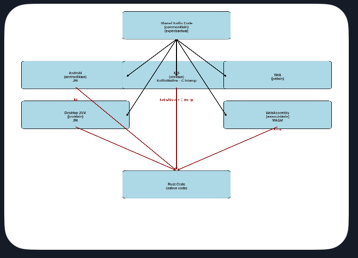

## 🧱 High-Level Folder Breakdown

### 🔁 Shared Code

- **`commonMain` / `commonTest`**
  - Core logic shared across all platforms.
  - Use `expect/actual` declarations here to abstract platform-specific implementations.
  - Ideal for physics engine, game logic, data models.

---

### 🍎 Apple Targets

- **`appleMain` / `appleTest`**

  - Shared code for Apple platforms (iOS, macOS).
  - Useful for logic that’s common to both iOS and macOS but not other platforms.

- **`iosMain` / `iosTest`**

  - iOS-specific code (UIKit, iOS sensors, etc).
  - Can include Swift interop via Kotlin/Native.

- **`iosArm64Main` / `iosSimulatorArm64Main`**
  - Architecture-specific folders for physical devices vs simulators.
  - Required for proper binary linking and testing.

---

### 🖥 JVM Targets

- **`jvmMain` / `jvmTest`**

  - Shared JVM code for Android and desktop.
  - Can include Java interop, JVM-specific libraries.

- **`jvmDev`**
  - Likely a custom source set for development/debug builds on JVM.
  - Useful for desktop previewing or tooling.

---

### 🌐 Web Targets

- **`jsMain` / `jsTest`**

  - Kotlin/JS code compiled to JavaScript.
  - Can interact with DOM, JS libraries, or WASM modules.

- **`wasmJsMain` / `wasmJsTest`**

  - WebAssembly-specific code.
  - Ideal for integrating Rust via WASM or high-performance physics modules.

- **`webMain` / `webTest`**
  - Likely a custom source set for web UI logic or Compose Web.
  - Useful for separating UI from low-level JS/WASM interop.

---

### 🧊 Native Targets

- **`nativeMain` / `nativeTest`**
  - Shared code across all native targets (iOS, macOS, Linux, etc).
  - Good for C interop, Rust bindings, or platform-agnostic native logic.

---

### 📦 Other Folders

- **`manifests`**

  - Platform-specific manifest files (AndroidManifest.xml, etc).
  - Controls permissions, entry points, etc.

- **`kotlin`**

  - Root source folder for Kotlin code.
  - May contain shared utilities or entry points.

- **`generated` / `assets` / `resources`**
  - Auto-generated code, static assets (images, sounds), and resource files (strings, layouts).

---

## 🧭 How This Supports Multiplatform Development

This structure lets you:

- Share physics/game logic across all platforms (`commonMain`).
- Customize rendering, input, and UI per platform (`iosMain`, `jsMain`, `jvmMain`).
- Integrate Rust via JNI (JVM), Kotlin/Native (iOS), and WASM (Web).
- Run platform-specific tests in isolated environments.

---

**Here’s a visual workflow diagram showing how Rust integrates into your Kotlin Multiplatform app across Android, iOS, desktop, and web targets.** It maps out how each platform accesses the Rust crate using JNI, Kotlin/Native, or WASM, unified through `expect/actual` declarations in shared code.

---

## 🧩 Diagram Highlights

- **`commonMain`** holds shared Kotlin code with `expect` declarations for your physics engine or core logic.
- **Platform-specific source sets** (`androidMain`, `iosMain`, `jvmMain`, `jsMain`, `wasmJsMain`) provide `actual` implementations that bridge to Rust.
- **Android & Desktop** use **JNI** to call Rust compiled as native libraries (`.so`, `.dll`).
- **iOS** uses **Kotlin/Native + C interop**, calling Rust via static libraries and C headers.
- **Web** uses **WASM**, compiling Rust to WebAssembly and exposing it via JS glue code.
- Arrows show how each platform connects to the Rust crate, maintaining a unified API surface.

---

## 🔧 Why This Matters for Your Architecture

This structure lets you:

- Keep your physics logic centralized and abstracted.
- Optimize performance by using native Rust code across all platforms.
- Maintain multiplatform ergonomics with Kotlin’s `expect/actual` model.
- Cleanly separate platform-specific bindings while preserving shared logic.

---